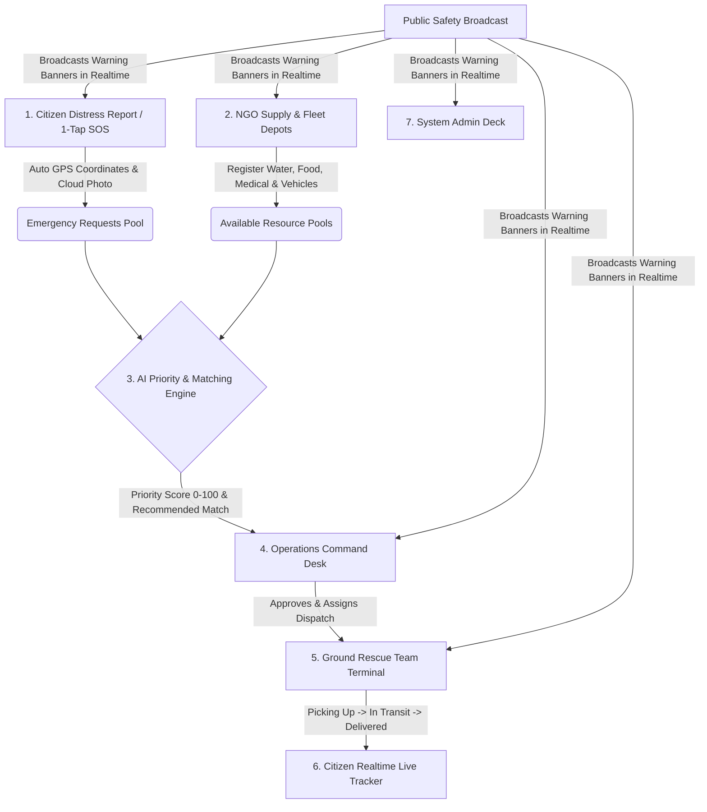

# 🚨 CivicResQ — Deterministic Disaster Response & AI Logistics Engine

[](https://reactjs.org/)
[](https://vitejs.dev/)
[](https://supabase.com/)
[](https://civicpulse-ai-pi.vercel.app)
[](LICENSE)

> **Live Production URL**: [https://civicpulse-ai-pi.vercel.app](https://civicpulse-ai-pi.vercel.app)  
> **Source Repository**: [https://github.com/Mir-Sarfaraz-Ahmed/CivicResQ](https://github.com/Mir-Sarfaraz-Ahmed/CivicResQ)

**CivicResQ** is a unified, military-grade crisis coordination and emergency logistics platform designed for humanitarian disaster response. It connects citizens, NGOs, ground rescue teams, operations commanders, and administrators through an AI-powered prioritization algorithm and automated resource-vehicle matching engine.

---

## 🗺️ Real-World End-to-End Crisis Workflow



1. **Phase 1: Distress Detection & Intake**: A stranded citizen triggers **1-Tap Quick SOS** or completes the **4-Step Emergency Wizard** on their mobile or web portal. GPS coordinates default to their exact live pin (or draggable Delhi map pin) and disaster damage photos are securely uploaded to **Supabase Cloud Storage**.
2. **Phase 2: AI Priority Computation**: The system deterministically computes a **Response Priority Score (0–100)** factoring in life-threat urgency (Critical, High, Medium, Low), affected headcount, and time elapsed.
3. **Phase 3: Automated Matching Engine**: In the Operations Command Room, the matching engine (`run_matching_engine()`) automatically pairs high-priority distress requests with registered NGO supplies (water, rations, trauma kits) and suitable rescue vehicles (boats, cargo trucks, medical vans).
4. **Phase 4: Ground Team Dispatch & Live ETA**: Operations approves the mission. The assigned Ground Rescuer receives the route on their mobile terminal, starts navigation via Google Maps, and a live ticking `MM:SS` countdown timer begins.
5. **Phase 5: Delivery & Citizen Lifeline Update**: Once the rescuer hands over relief items, they tap **Mark Delivered**, instantly updating the citizen's 4-stage live tracker in real time.

---

## 🌟 Key Portals & Features

### 🌐 0. High-Impact Landing Page (`/`)
- **Live Incident Terminal Launcher**: Instant access to the platform command centers.
- **⚡ 1-Click Interactive Persona Sandbox**: Test live access across all 5 roles in 1 tap.
- **Live AI Priority Score Simulator**: Real-time interactive formula sandbox with urgency toggles and headcount sliders.
- **Regional Broadcast Alert System**: Real-time warning banners synced over WebSockets.

---

### 👤 1. Citizen Emergency Lifeline (`/citizen/dashboard`, `/citizen/report`, `/citizen/shelters`)
- **4-Step Emergency Reporting Wizard**: Auto-saves drafts across page refreshes via `localStorage`, centers location pins on Delhi/NCR landmarks with draggable Leaflet map pickers.
- **1-Tap Quick SOS Trigger**: Auto-fetches GPS coordinates and dispatches immediate priority rescue signals.
- **Cloud Photo Uploads**: Damage evidence images uploaded directly to Supabase Cloud Storage.
- **Live Response Pipeline**: Real-time 4-stage tracking (*Review* → *Matched* → *Transit* → *Delivered*) with dynamic priority score progress bars.
- **Shelters Map & Directory**: Search safe zones in Delhi (Pragati Maidan, AIIMS South Delhi, Connaught Place), filter by amenities (*Food Ready*, *Clean Water*, *Medical Support*), and trigger Google Maps route navigation.

---

### 🏢 2. NGO Supply & Transport Logistics (`/ngo/dashboard`, `/ngo/resources`, `/ngo/vehicles`)
- **Supply Pool Management**: Register resource inventories (water, rations, trauma kits, power) with geolocation pins, quantities, units, and expiry dates.
- **Fleet Transport Vehicles**: Manage utility trucks, medical vans, and rescue boats with capacity and availability states.
- **Incoming Distress Radar**: Live incoming emergency signals feed to match local relief supplies.

---

### 🚒 3. Ground Rescue Team Terminal (`/ground/dashboard`)
- **Mission Execution Queue**: View assigned dispatches with headcount details, supply cargo, and navigation links.
- **Real-Time `MM:SS` Countdown Clock**: Live ETA countdown timer hook with automatic overdue alert styling.
- **1-Click Pipeline Advancement**: Progress dispatches from `ASSIGNED` → `PICKING_UP` → `IN_TRANSIT` → `DELIVERED`.

---

### 📡 4. Operations Command Center (`/operations/dashboard`)
- **Live Telemetry Desk**: Live metric counters for pending review, active dispatches, resolved incidents, and NGO partnerships.
- **Triage & Request Queue**: Full modal inspector to evaluate citizen distress reports.
- **Engine Room Tab**:
  - Priority Queue Heatmap with on-demand recalculation triggers (`calculate_priority`).
  - One-Click **"🚀 Run Matching Engine"** invoking automated multi-factor pairing (`run_matching_engine`).
  - 4-Stage Dispatch Lifecycle Kanban (*Awaiting*, *Approved*, *In Transit*, *Delivered*).
- **Public Safety Broadcast System**: Push regional disaster warnings across all user dashboards with 4 severity levels (`CRITICAL`, `WARNING`, `ADVISORY`, `INFO`).

---

### 🛡️ 5. System Administration & Governance (`/admin/dashboard`)
- **User Role Management**: Role promotions and suspensions with protected Root Admin account rules.
- **NGO Authorization Workflows**: Review, approve, or reject NGO partner applications with real-time status propagation.
- **Incident Simulator**: Map-based distress simulation and mass disaster cluster seeding.
- **Security Audit Trails**: Timestamped immutable record of administrative actions.

---

## 👥 Demo Credentials (Mock & Live Production)

| Role | Email | Password | Access Path |
|---|---|---|---|
| 🛡️ **System Admin** | `admin@civicresq.com` | `password` | `/admin/dashboard` |
| 📡 **Operations Commander** | `ops@civicresq.com` | `password` | `/operations/dashboard` |
| 🚒 **Ground Rescuer** | `ground@civicresq.com` | `password` | `/ground/dashboard` |
| 🏢 **NGO Lead** | `ngo@civicresq.com` | `password` | `/ngo/dashboard` |
| 👤 **Citizen** | `citizen@civicresq.com` | `password` | `/citizen/dashboard` |

> *Tip: A floating **1-Click Role QuickSwitcher** capsule is docked in the bottom-right corner when logged in to swap roles effortlessly.*

---

## ⚙️ Architecture & Tech Stack

- **Frontend**: React 19, React Router v7, Lucide Icons, Leaflet Maps, Canvas Confetti.
- **Styling**: Vanilla CSS with custom HSL design tokens, glassmorphism, and hardware-accelerated animations.
- **Backend & Cloud Services**: Supabase PostgreSQL, Realtime WebSocket Publication, Cloud Storage Buckets, Edge SQL Procedures.
- **Dual Runtime Modes**:
  - **Live Mode**: Direct connection to Supabase database, authentication, and cloud storage.
  - **Mock Demo Mode**: Built-in simulated state with pre-seeded demo accounts for offline or immediate testing.

---

## 🚀 Local Development Setup

### Prerequisites
- Node.js (v18 or higher)
- npm or pnpm

### Installation Steps

1. **Clone the repository**:
   ```bash
   git clone https://github.com/Mir-Sarfaraz-Ahmed/CivicResQ.git
   cd CivicResQ
   ```

2. **Install dependencies**:
   ```bash
   npm install
   ```

3. **Configure Environment Variables**:
   Create a `.env` file based on `.env.example`:
   ```env
   VITE_SUPABASE_URL=https://your-project.supabase.co
   VITE_SUPABASE_ANON_KEY=your-anon-key
   ```
   *(If omitted, the platform automatically runs in built-in offline Mock Demo Mode).*

4. **Start Development Server**:
   ```bash
   npm run dev
   ```
   Open `http://127.0.0.1:5173` in your browser.

5. **Build for Production**:
   ```bash
   npm run build
   ```

---

## 📄 License
This project is licensed under the MIT License - see the [LICENSE](LICENSE) file for details.
