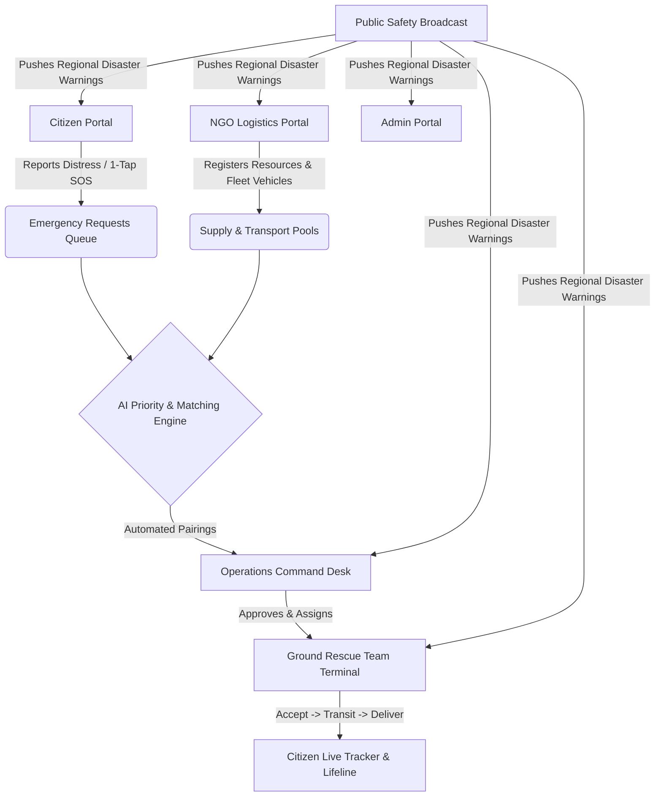

# CivicResQ — Deterministic Disaster Response & AI Logistics Engine

[](https://reactjs.org/)
[](https://vitejs.dev/)
[](https://supabase.com/)
[](LICENSE)

**CivicResQ** is a unified, real-time crisis coordination and emergency logistics platform designed for humanitarian disaster response. It connects citizens, NGOs, ground rescue teams, operations commanders, and administrators through an AI-powered prioritization algorithm and automated resource-vehicle matching engine.

---

## 🌟 Key Features & Portals

### 1. 👤 Citizen Emergency Lifeline (`/citizen/dashboard`, `/citizen/report`, `/citizen/shelters`)
- **4-Step Emergency Reporting Wizard**: Auto-saves drafts across page refreshes, centers location pins on Delhi/NCR landmarks with draggable Leaflet map pickers.
- **1-Tap Quick SOS Trigger**: Auto-fetches GPS coordinates and dispatches immediate priority rescue signals.
- **Live Response Pipeline**: Real-time 4-stage tracking (*Review* → *Matched* → *Transit* → *Delivered*) with dynamic priority score progress bars (0–100).
- **Shelters Map & Directory**: Search safe zones, filter by amenities (*Food Ready*, *Clean Water*, *Medical Support*), and trigger Google Maps route navigation.

### 2. 🏢 NGO Supply & Transport Logistics (`/ngo/dashboard`, `/ngo/resources`, `/ngo/vehicles`)
- **Supply Pool Management**: Register resource inventories (water, rations, trauma kits, power) with geolocation pins, quantities, units, and expiry dates.
- **Fleet Transport Vehicles**: Manage utility trucks, medical vans, and boats with capacity and availability states.
- **Incoming Distress Radar**: Live incoming emergency signals feed to match local relief supplies.

### 3. 🚒 Ground Rescue Team Terminal (`/ground/dashboard`)
- **Mission Execution Queue**: View assigned dispatches with headcount details, supply cargo, and navigation links.
- **Real-Time `MM:SS` Countdown Clock**: Live ETA countdown timer hook with automatic overdue alert styling.
- **1-Click Pipeline Advancement**: Progress dispatches from `ASSIGNED` → `PICKING_UP` → `IN_TRANSIT` → `DELIVERED`.

### 4. 📡 Operations Command Center (`/operations/dashboard`)
- **Live Telemetry Desk**: Live metric counters for pending review, active dispatches, resolved incidents, and NGO partnerships.
- **Triage & Request Queue**: Full modal inspector to evaluate citizen distress reports.
- **Engine Room Tab**:
  - Priority Queue Heatmap with on-demand recalculation triggers (`calculate_priority`).
  - One-Click **"🚀 Run Matching Engine"** invoking automated multi-factor pairing (`run_matching_engine`).
  - 4-Stage Dispatch Lifecycle Kanban.
- **Public Safety Broadcast System**: Push regional disaster warnings across all user dashboards with 4 severity levels (`CRITICAL`, `WARNING`, `ADVISORY`, `INFO`).

### 5. 🛡️ System Administration & Governance (`/admin/dashboard`)
- **User Role Management**: Role promotions and suspensions with protected Root Admin account rules.
- **NGO Authorization Workflows**: Review, approve, or reject NGO partner applications with real-time status propagation.
- **Incident Simulator**: Map-based distress simulation and mass disaster cluster seeding.
- **Security Audit Trails**: Timestamped immutable record of administrative actions.

---

## ⚙️ Architecture & Tech Stack



- **Frontend**: React 18 / 19, React Router v7, Lucide Icons, Leaflet Maps, Canvas Confetti.
- **Styling**: Vanilla CSS with custom HSL design tokens, glassmorphism, and hardware-accelerated animations.
- **Backend & Realtime**: Supabase Postgres, Realtime Channels, Edge RPCs.
- **Dual Runtime Modes**:
  - **Live Mode**: Direct connection to Supabase database and authentication.
  - **Mock Demo Mode**: Built-in simulated state with pre-seeded demo accounts for offline or immediate testing.

---

## 🚀 Getting Started

### Prerequisites
- Node.js (v18 or higher)
- npm or pnpm

### Installation

1. **Clone the repository**:
   ```bash
   git clone https://github.com/Mir-Sarfaraz-Ahmed/CivicResQ.git
   cd CivicResQ
   ```

2. **Install dependencies**:
   ```bash
   npm install
   ```

3. **Configure Environment Variables** (Optional for Supabase connection):
   Create a `.env` file based on `.env.example`:
   ```env
   VITE_SUPABASE_URL=https://your-project.supabase.co
   VITE_SUPABASE_ANON_KEY=your-anon-key
   ```
   *(If omitted, the platform automatically runs in Mock Demo Mode).*

4. **Start Development Server**:
   ```bash
   npm run dev
   ```
   Open `http://localhost:5173` in your browser.

5. **Build for Production**:
   ```bash
   npm run build
   ```

---

## 👥 Demo Credentials (Mock & Live Mode)

| Role | Email | Password |
|---|---|---|
| 👤 **Citizen** | `citizen@gmail.com` | `password` |
| 🏢 **NGO Lead** | `ngo@gmail.com` | `password` |
| 🚒 **Ground Team** | `ground@gmail.com` | `password` |
| 📡 **Operations** | `ops@gmail.com` | `password` |
| 🛡️ **System Admin** | `admin@gmail.com` | `password` |

*Tip: A floating **1-Click Role QuickSwitcher** capsule is docked in the bottom-right corner when logged in to swap roles effortlessly.*

---

## 📄 License
This project is licensed under the MIT License - see the [LICENSE](LICENSE) file for details.
